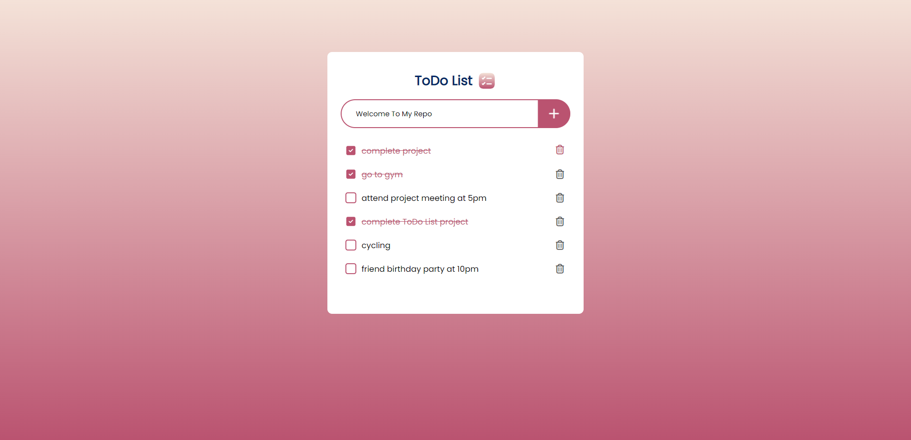

# ToDo List Project
This project is a simple yet powerful TODO list application designed to help you stay organized and manage your tasks effectively.

In this, you can easily add tasks, delete them, and mark them as complete, streamlining your task management process.

## Features
User can add, delete and mark task as complete.

Data remains accessible even if you close or refresh the page.

User-friendly and minimal design.

### How To Use This Repo
Download this repo and run in `VScode` with extension `Live Server`  and you are done👍

#### `Final Output`

